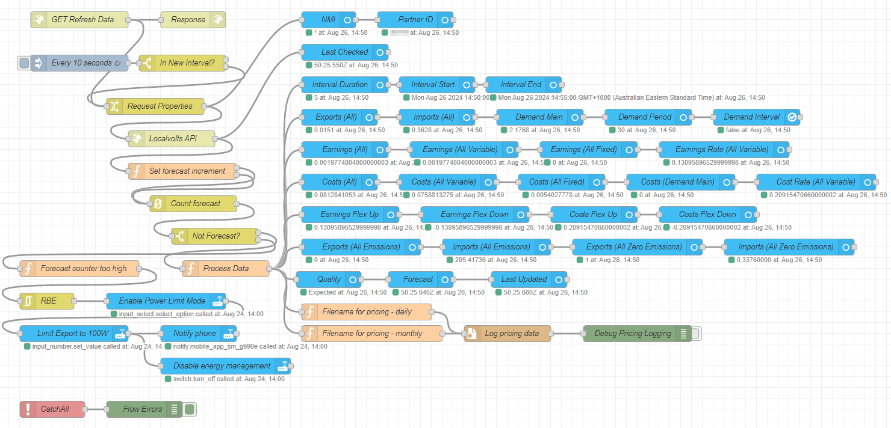
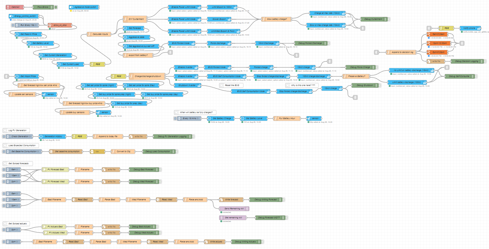

# Localvolts Sungrow Home Assistant Manager
Control your **Sungrow** Hybrid inverter with **LocalVolts** through **Home Assistant** using **NodeRed**

> [!IMPORTANT]
> Note: You MUST have a battery for this management system, unless you want to perform a lot of modifications to it.

> [!NOTE]
> This project is still a work-in-progress. If you have ideas on how to make this integration better, please start a discussion.

This repository depends on a number of great repositories, some of which have been customised for my own personal use. 
I have forked these repositories, since I have updated some content, so all instructions are based on my own forks, though you should be able to get the originals working yourself with some minor updates.

The work I have done has only been made possible by the great work of the authors of the following repositories:
- [HA Localvolts](https://github.com/melvanderwal/HA-Localvolts)
- [HA Solcast](https://github.com/davidrapan/ha-solcast)
- [Sungrow SHx Inverter Modbus Home Assistant](https://github.com/mkaiser/Sungrow-SHx-Inverter-Modbus-Home-Assistant))
- [HA Amber Electric Usage Charts](https://github.com/melvanderwal/HA-Amber-Electric-Usage-Charts)
- [Node-Red HA Solar Management](https://github.com/guysqr/node-red-ha-solar-management)

I have also created a number of HASS entities and helpers to get it to do what I wanted personally, that are not included in the above repos, so make sure you don't miss these or your dashboards and energy management will not work correctly or as intended.

Some of the original repositories were taylored for Amber Electric (another Australian energy retailer passing on (near) wholesale prices), but since (at the time of writing) they only support averaged 30 minute charging windows, was not suitable for me as the Sungrow inverter can change settings within just a couple of seconds, so 5 minute intervals can be used and you can buy or sell right down to the 5 minute intervals and be much more efficient in your trading, and not have a 30 minute period averaged out.

## What does this actually do?
This project is a near complete export of my current energy management/energy trading system that I use to control my energy as purchased and sold through the Australian Localvolts (localvolts.com) electricity provider that allows us to buy and sell on the Australian wholesale electricity market. The system uses the LocalVolts API to retrieve pricing information in 5 minute blocks, and then uses Home Assistant (which uses NodeRed for the smarts) to control my Sungrow hybrid inverter.

Some very high level features are:
- Constantly monitors the Localvolts 5 minute pricing.
- Curtails export when feed-in tarrif is negative (you would normally have to pay to export during negative periods).
- Exports energy when the feed-in tarrif is positive (definable when it exports energy).
- Charges your battery from your solar by default, but charges from the grid if the import price is negative (that is, you get paid to take the energy).
- On a really sunny day, will prioritise exporting to the grid during +ve FIT periods, if it calculates that there is plenty of generation remaining for the day to get your battery fully charged before the sun goes down.
- Watches for surge pricing and charges the battery up in preparation, then exports while the price is high. Watches for both the morning shoulder and evening demand surges, if they are predicted.
- Will change how aggressively it will export your power during a surge depending on how much storage you have remaining, so you can keep some stored energy for yourself to get you through the surge without depleting what you have.
- Works closely with Solcast Solar forecasts to be able to predict the amount of solar that is likely to be generated over the day and charge up your battery when the power is most likely going to be the cheapest in preparation for the night, if not enough PV generation is likely to occur.
- Configurable "typical consumption" profile can be created so the management system can work out how much solar energy is required - comparing what is required to charge your battery, with how much you will typically take from the battery before the sun goes down, so it knows whether it can charge passively through the sun, or pull from the grid to get your battery to capacity in time.
- Sets battery SOC backup reserves so that you don't export all your energy during a surge, as you won't want to pay for the high priced power if you run out of stored energy.
  - Sets separate SOC reserves for main evening demand periods and morning shoulder period. Keeps enough power in your battery for the morning shoulder period so that you can get through it without having to draw from the grid
- Creates dashboards so you can monitor what is happening:
  - Home Assistant based dashboard showing 4hr and 24hr price forecasts, along with the next 5 days of solar forecasts for your PV array, and some basic usage graphs
  - Grafana based dashboard showing current buy and sell prices, current import and export, charge and discharge, battery level, plus more

# Logic behind management
The following is the logic behind the coding in the Node-Red flows. Note that all of these can be customised to suit your particular situation, battery size, solar PV size, typical daily usage, etc.  For example, if you are able to export more than 5kW (perhaps you are on a plan that allows a 10kW export and you have a suitably sized inverter), then you should definitely update this decision matrix. You should probably change these decisions based on the seasons too.  These are coded in Javascript within the Node-Red flows.

## FIT/Export

| FIT | Battery Level | Time | Rate | Decision |
|---|---|---|---|---|
| > $1.00 | > 40% | Any | 5kW | Export, has excellent FIT |
| > $0.60 | > 50% | Any | 5kW | Export, has great FIT |
| > $0.50 | > 60% | Any | 5kW | Exort, has good FIT |
| > $0.40 | > 70% | Any | 5kW | Export, has good FIT |
| > $0.30 | > 80% | Any | 5kW | Export, has ok FIT |
| > $0.30 | > 8% | 6-8am | 5kW | Export, has ok FIT |
| > $0.00 | = 100% | Any | 5kW | Export, +ve FIT |
| = $0.00 | = 100% | Any | 2.5kW | Export, why not? |
| < $0.00 | = 100% | Any | 0kW[^1] | Curtailed, it costs to export |
| < $0.00 | < 100% | Any | 8.5kW[^2] | Import, free power! |

[^1]: In reality, this should be set to 100W as 0kW may be seen as no setting.

## Import

| Cost | Battery Level | Time | Rate | Decision |
|---|---|---|---|---|
| < $0.25 | < 40% | 4-5am | 10kW | Import, prepare for morning shoulder if export forecast to be > $0.50 FIT [^4] | 
| < $0.00 | < 98% | < 4pm, > 9pm[^2] | 10kW | Import, free power, if in cheapest part of next 4hrs forecast | 
| < -$0.03 | < 100% | < 4pm, > 9pm | 0kW | Import, shut down intervert, paid to import | 
| < $0.49[^4] | <100%  | 3-4pm | 10kW | Import, prepare for evening spike if export forecast to be > $2 FIT |
| < $0.25[^4] | < 80% | > 3pm | 10kW | Import, not much solar, need to store for peak | 
| < $0.04[^4] | < 30% | < 8am | 10kW | Import if early as cheap, but only until solar gens | 
| < $0.04 | < 75% | 12-4pm or > 4pm | 10kW | Import, low battery, cheap power |
| < $0.04 | < 100% | 10am-4pm | 10kW | If little solar, import | 
| < $0.04 | < 100% | Cheapest period | 10kW | Cheapest period, not enough solar forecast, import | 

> [!TIP]
> Note that all of these can be changed based on your own requirements. Note also that a number of them can have the cost configured through HASS sliders.

[^2]: Bypasses demand period of 4-9pm (QLD)
[^3]: This will depend on your inverter capability
[^4]: Configurable through HASS sliders (all other code is configurable anyway)

## Preserve battery

| Time | Cost | Decision |
|---|---|---|
| < 1pm | Any | Use battery as required |
| > 1pm | < $0.05 | Grid is cheaper than battery cycles, draw from grid |
| > 1pm | > $0.05 | Best to use battery than draw from grid |

# Requirements
- A working instance of Home Assistant (full, not core!)
- Node-Red plugin installed in HASS
- Node-Red Companion installed in HASS
- API enabled in HASS (for dashboards, default)
- MQTT instance available (will install)
- Grafana instance available (optional for dashboard, but very recommended)
- ApexChart installed and enabled in HASS (optional for dashboard)
- Sungrow support enabled in HASS (to local ModBus)
- Localvolts support enabled in HASS (you need an access token and partner number, so you must already be a Localvolts customer)
 
# Screenshots of it in action
### Home Assistant
#### Node-Red
A set of flows pull the pricing information from LocalVolts at regular intervals

The main energy management flows control the charging/discharging/import/export/curtailing of energy, based on the Localvolts pricing

They also control the retrieval of solar forecasts from solcast.com, for your specific property (you need a Solcast account - which is free for up to 10 API calls per day)

### Buy/Sell price archival
An archive is optionaly kept of each 5 min buy and sell price, unique to your NMI, as taken from the LocalVolts API

### Decision log
Each time a decision is made on import/export/curtail/charge/discharge, it is logged for your reference and troubleshooting

### HASS Energy Dashboard
The built in energy dashboard can be configured to show your PV generation/import/export/battery usage

> [!TIP]
> Note that if you curtail your solar, like in this case, you will not see what you "could have" generated, but what your inverter "let through".

### HASS PV Dashboards
Various PV dashboards are displayed so you know what is going on at a glance

> [!NOTE]
> Note that the second PV dashboard allows you to manually control your inverter. It also allows you to disable energy management, in case there are issues, or you simply want to control it yourself

### HASS Costs Dashboard
Various ApexChart graphs can be displayed showing you your approximate costs so far. Note this should be used as a guide only as the final cost will always be what Localvolts state it is.

### Dashboards for tablets
I use two older Microsoft Surface tablets to display what is currently happening, so I don't have to keep looking in an app in my phone.

Dashboard 1: HASS price and solar generation forecasts

This dashboard shows the price forecasts for buying and selling for both the next 4hrs (so you can spot an close upcoming spike) and for 24hrs. It also includes the solar predications for the next 5 days, taken from Solcast. It is running a HASS dashboard.

This dashboard shows more information and runs on Grafana. It shows the following:
- Current solar/PV generation
- How much of your solar/PV is being used
- The current buy and sell prices, with trends
- The forecasted buy and sell prices, for the next 24 hours
- Whether your inverter is currently curtailing
- The current battery charge level
- An estimate of when your battery will be full, based on your reference usage and forecasted solar/PV generation
- The current amount of energy that you have generated today (excluding any that was curtailed)
- The current amount of energy being imported or exported, along with history
- The current amount of energy being used to charge your battery, or being discharged from it, along with history
- Your energy usage summary for the last (configurable) 12 hours

## How difficult is it to set it up and maintain?
There is a fair amount of technical stuff you will need to firstly understand, and then secondly you will need to be able to action and configure yourself. It's not for non-technical people as you do need to know what you're dong.  If you don't know basic coding, you may find it challenging. If you find just Home Assistant to be too complex and daunting, then this project is most definitely not for you. You will need to know Home Assistant quite intimately.

## What about other inverter brands?
This repository is designed for Sungrow only. You may be able to get it working with other brands, but you will be on your own unfortunately, unless there is someone nice enough to help you out, because they have one as well. Sungrow is the chosen brand due to its popularity and ability to intergrate with its modbus and control it with only a second or two delay, and without having to use the manufacturers API (here's talking to you, Tesla).  None of this waiting 5 minutes for the inverter to change mode - the 5 minute pricing may have changed before you even get to start importing or exporting.

## Something is wrong
There are bound to be times when things go wrong, so if you're not prepared to put in the effort, this probably is not the right thing for you. You will have to be very hands on and understand what you're doing, or you may end up costing yourself some hard earned money because your inverter exported or imported when it shouldn't have, because you didn't configure it right, or there was something wrong in the code.  I take absolutely no responsibility for how this may work, or may not work, for you. You use this ENTIRELY AT YOUR OWN RISK.
If something is wrong, or you need help, feel free to post an issue (if you know that it is a coding issue) or start a discussion (if you just need some help) and someone may be able to help you out.

# Installation Instructions
Please refer to the following [instructions](instructions.md) that are based on a fresh Home Assistant (full) installation.
