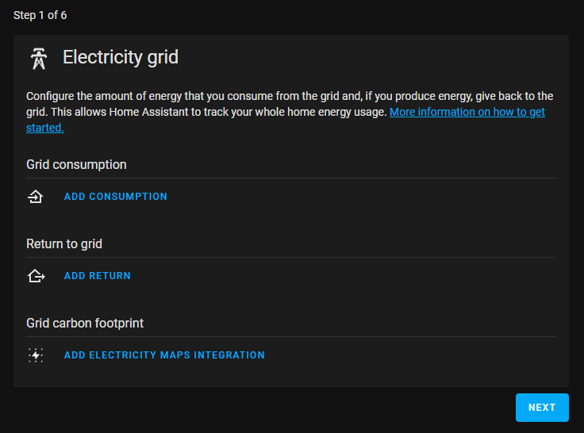

# Instructions

> This is PART ONE of a series of instruction pages

I have made forks of all the great repositories that I have used to get this working for myself. Some of the repositories have been updated to work how I want them to, so I would recommend following these instructions to get it working, rather than the originals, then returning to your system and reconfiguring it more to suit your own personal requirements better.  
> [!TIP]
> You should be able to get it going by using the original repositories with some minor tweaks, but you may miss out of some features (which could be good or bad!)

> [!NOTE]
> My hardware is as follows, so take this into consideration when you build your own system. You more than likely will need to customise it a bit to suit. I make no guarantees that this will work for you. You may need to experiment a bit.
> 
> - Inverter: Sungrow SH10RS (Single phase 10kW Hybrid)
> - Solar: 16.7kW PV array
> - Battery: Sungrow SBR192 (19.2kW storage)
> - Modbus connection: Sungrow WiFi dongle (yes, WiFi)
> - Home Assistant: Virtualised on the vmware hypervisor

>[!IMPORTANT]
>These instructions ssume that your instance of Home Assistant will be resolvable on http://homeassistant.local:8123

## Step 1: Home Assistant (HASS) build
You should install Home Assistant on your own Raspberry Pi, physical or virtual server yourself and then return here.
> [!TIP]
> Use a self-hosted Home Assistant. This way you do not have to talk to your inverter over the internet, but just on your own local network. It also means that any dashboards you create do not communicate outside of your network, and probably have a faster connection.  There is no requirement for this system to talk to isolarcloud.com. Home Assistant will, however, need to talk to the Localvolts API.

> [!IMPORTANT]
> Make sure that you install the FULL version of Home Assistant (known as "Home Assistant OS") or else various required features will be missing and your install will not work correctly. A link the release can be found [here](https://github.com/home-assistant/operating-system/releases). The "core" version is _not_ appropriate.

- Raspberry Pi installation instructions: [Raspberry Pi Home Assistant](https://www.home-assistant.io/installation/raspberrypi)
- Other Linux installation instructions: [Linux Home Assistant](https://www.home-assistant.io/installation/linux)
- Windows installation instructions: [Windows Home Assistant](https://www.home-assistant.io/installation/windows)

I personally use the OVA version by importing into vmware, but your most likely choice would be to purchase a cheap Raspberry Pi and install on there (you probably don't have a vmware host at home like me).

## Step 2: Preparation work
### Install HACS (Home Assistant Community Store)
The following instructions are based on the [HACS download page](https://hacs.xyz/docs/setup/download/):
1. Go to the Add-on store (Settings -> Add-ons -> Add-on store (bottom right))
2. Install "Advanced SSH & Web Terminal"
  
  
3. Go to the configuration tab of the add-on and enter the appropriate password
  
  
4. Start the SSH add-on (it may take a few minutes to start)
5. Enable the "Watchdog" and "Show in sidebar" sliders
6. Launch a SSH session (from "Terminal" on the side bar), and then run the following:
```
wget -O hacs.sh https://get.hacs.xyz
```
  

7. After the script completes, restart Home Assistant (always check "Developer Tools" -> "Check configuration" first)
8. Once HASS has restarted, click on Settings -> Devices & services -> Add Integration (bottom right)
9. Search for HACS and select it.
10. Acknowledge everything (after you've read and agreed with them) and press Submit
11. Do what it says, open the URL and paste in the authorisation code as displayed to you

> [!TIP]
> Refer to this [link]("https://hacs.xyz/docs/faq/github_account") for information on why a Github account is required.

12. Once your device is authorised, close the authorisation tab (but not your main HASS tab), and then you should receive a success message. Click "Finish", and HACS will appear in your side bar.

### Install Apexcharts
Apexcharts is a great add-on to allow you to draw charts. In this case, it will be used for one of the Localvolts forecast charts (the other being in Grafana), displayed directly in Home Assistant.

1. Go into HACS and type "Apexcharts" in the search area
  
  
2. Select it and then click "Download"
3. Reload your browser when prompted

### Install Node-Red
Node-Red will be used quite extensively in our energy management, so this installation is very important.
1. Go into Settings -> Add-ons
2. Click on "Add-on store"
3. Search for "node-red"


4. Select it and install
5. Enable "Watchdog" and "Show in sidebar" options
6. Go to the configuration page and unselect SSL if you're not using it, and hit save
7. Return to the Info page and start the add-on

### Install Node-Red Companion
1. Go into HACS and search for "Node-RED Companion"


2. Download the add-on
3. Click on "Add Integraton to My (icon)"
4. Follow the steps to install the Node-Red Companion
5. Restart HASS (remember to check the configuration first)

### Install Kiosk mode
Kiosk mode allows you to view a dashboard on a tablet without side bar and headers, etc.
1. Go into HACS and search for "Kiosk"


2. Download the add-on
3. Reload the browser when requested

### Install MQTT
A MQTT (Mosquitto) broker is required to hold some values from the energy management flows that we will create shortly in Node-Red.

1. Go to Settings -> Add-ons -> "+ Add-on store" and search for MQTT

2. Select it and click on "Install"
3. Enable "Watchdog" and click on "Start"

## Step 3: Solcast integration
An important part of our energy management system is the ability to be able to predict what the weather is going to be like over the next few days, especially for the rest of today so decisions on what to do can be based on the probable future solar generation.  The Node-Red flows that we will create at a later step rely quite heavily on being able to estimate how many sun hours are remaining for your exact geographical location and your specific solar array setup. This will allow the system to make decisions on when it is best to save solar generation, when to export it, and when to charge up in preparation for bad weather.
To do this, we will be using solcast.com services. This is free for a home user for up to 2 arrays (perhaps east/west, or north/west, etc) and allows up to 10 API calls per day. If you have two strings in your solar PV array, you will want to make use of all 10 API calls. If you have more than 2 strings, unfortunately you will need to "estimate" two arrays (or purchase a plan from solcast.com).
1. Sign up for a free home user account at solcast.com
2. Create your arrays so that you have access to your custom array resource ids that will be needed later

We will be using solcast data in two ways:
1. For an graphical estimate in your energy dashboard for the coming week (1 API call per array, so in this case 2 API calls)
2. To work out how many hours of sunshine is forecast for your area for energy management (the remaining 8 API calls)

The following steps are required for the energy dashboard data, while Node-Red will obtain data through their API separately.
1. Browse to HACS in Home Assistant - HACS -> Integrations
2. From the dots at the top right of the screen, select "Custom respositories"
3. In the "Repositories" box that appears, enter https://github.com/saltpool/ha-solcast
4. Select the category type of integration, an click "Add"
5. Then once it's there (still in HACS), click on the new integration and then download it (if it doesn't install, follow the manual installation process that is described on the page)
6. Restart HASS
7. Go into Settings -> Devices and services and select "Add Integration"
8. Search for "Solcast PV Forecast" and select it.
9. Add your Solcast API key (this is obtained from solcast.com -> select your profile and then "Your API Key") and click Finish.

We now need to schedule the forecast data to be pulled from the Solcast API once pey day. We don't want to pull any more frequently than this as we are limited to 10 per day, and the Node-Red flows will pull more often for energy management. The forecast data here is only for the energy dashboard so once a day should be fine, it's not used for decision making.

1. Go into Settings -> Automations & scenes
2. Click on "+ Create Automation"
3. Select "Create new automation"
4. Under "When", select "+ Add trigger"
  1. Select "Time and location"
  2. Select "Time"
  3. Keep "Fixed time" and enter in a suitable time, e.g., 5:00am
5. Under "Then do", select "+ Add action"
  1. Under "Other options" select "Perform action"
  2. Select "Solcast PV Forecast: Update"
6. Name the automation "Solcast update" and save.
7. Run the automation once.

> [!TIP]
> More information on this integration can be found in the [repository](https://github.com/saltpool/ha-solcast). Hint - you should read it to understand it better, what is contained on this page is only the bare minimum to get you going.

## Step 4: Sungrow inverter integration with HASS
This step is based on the following repository: [Sungrow-SHx-INverter-Modbus-Home-Assistant](https://github.com/saltpool/Sungrow-SHx-Inverter-Modbus-Home-Assistant)

### Install Visual Studio Code Server
Visual Studio Code Server will make your editing work easier, so install it as follows:
1. Settings -> Add-Ons
2. Click on "Add-on Store" from the bottom right
3. Search for "Studio Code Server" and select it when found

4. Click on "install"
5. Once installed, enable "watchdog" and "show in sidebar" and click on "start"


### Launch Visual Studio Code and configure Sungrow Modbus
1. Edit your "secrets.yaml" file
  1. Paste in the following:
     ```
     sungrow_modbus_host_ip: 192.168.x.x # Update with the IP of your inverter. No default. Check the IP of your inverter!
     sungrow_modbus_port: 502 # Update with the Modbus port of your inverter. Default is '502'
     sungrow_modbus_slave: 1 # Update with the slave address of your inverter. Default is '1'
     ```
> [!IMPORTANT]
> Update each line appropriately, especially your inverter IP address, as it won't work without it!

3. Create a folder in the config directory called "intergrations"


4. Copy the [modbus_sungrow.yaml](yaml/modbus_sungrow.yaml) file to the integrations directory
5. Modify the modbus_sungrow.yaml file appropriately for your inverter size, especially lines 2380, 2386 and 2392.
6. Modify the configuration.yaml file by adding the following code, if it doesn't already exist:

   ```
   homeassistant:
     packages: !include_dir_named integrations
   ```


> [!WARNING]
> It is extremely important to format yaml files correctly. Indents are very important and Home Assistant may not load on restart if it contains any errors.

6. Check the configuration is ok by going to Developer Tools and clicking "Check Configuration". Never restart HASS without doing this in case there is an issue with your YAML.
7. As long as the configuration check comes back fine, restart your HASS instance.

8. Once HASS has been rebooted, browse to Settings -> Devices & services -> Entities, and you should find some new sensors present:


If you click on a sensor, you should see the current state. If this is seen, your modbus is being queried successfully.

### Configure the HASS Energy Dashboard
1. Click on "Energy" from the side menu
2. On step 1 "Electricity grid", configure as appropriate:
   
   1. For "Add consumption", select "Total imported energy".
   2. For "Add return", select "Total exported energy"
3. On step 2 "Solar panels", configure as appropriate:
   
   1. For "Add solar production", select "Total PV production"
   2. Click on "Forecast production" and tick "Solcast PV Forecast"
4. On step 3 "Home battery storage", configure as appropriate:
   
   1. Click on "Add Battery System"
   2. For "Energy going in to the battery", select "Total battery charge"
   3. For "Energy coming out of the battery", select "Total battery discharge"
5. Ignore the "Gas consumption" page
6. Ignore the "Water consumption" page
7. Click on "Show me my energy page"

### Add the PV Dashboards
1. Copy the content of the [dashboards/pv-dashboard.yaml](dashboards/pv-dashboard.yaml) file (hint, copy as raw)
2. Go to Settings -> Dashboards
3. Click on "+ Add Dashboard" from down the bottom right of the screen
4. Select "New dashboard from scratch"
5. Name it "PV" (or whatever you want) and select the icon "mdi:solar-power-variant-outline" (or whatever icon you want)
6. Click "Create"
7. Select "Open" from next to the new dashboard in the list
8. Click on the pencil/edit icon at the top right of the page
9. Click on the three dots at the top right of the page and select "Raw configuration editor"
10. Paste the content from above (the dashboard.yaml content)
11. Click "Save" and close the dashboard.
12. Click "Done"

> [!TIP]
> There may be two "Entity not available" warnings on the dashboard (sensor.battery_cycles_per_day and switch.energy_control_on_off). Don't worry about these, we will come back and create these sensors in a future step - they just haven't been created yet.


**Continue to part two of the instructions [here](instructions2.md).**
