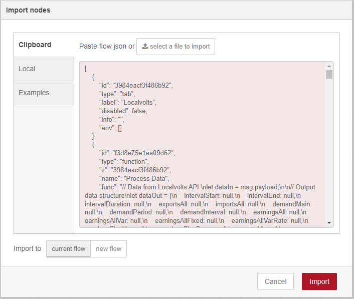
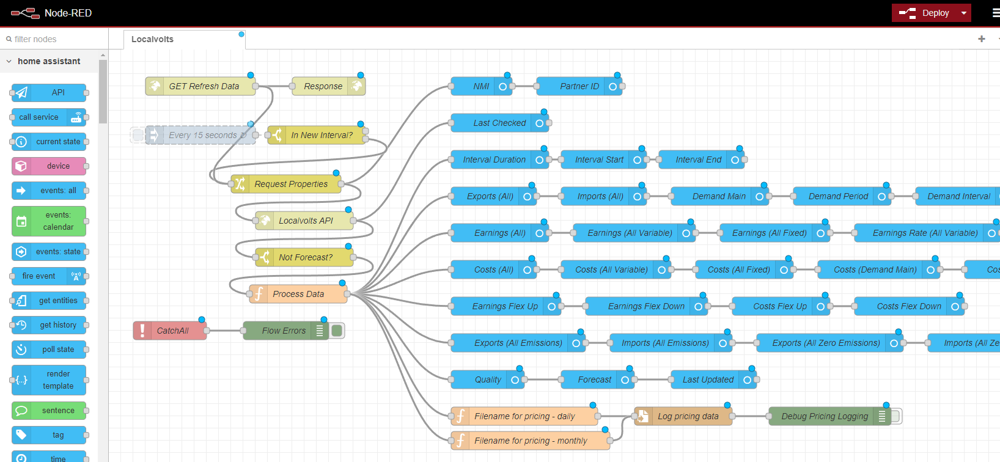
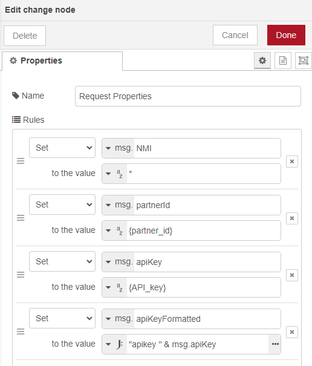
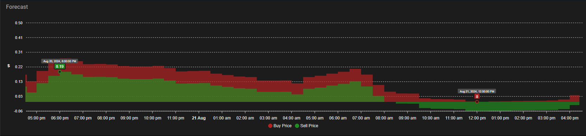

# Instructions continued...
> This is PART TWO of the instructions

## Step 5: Localvolts integration
Since we will be retrieving our energy pricing from Localvolts, we need to add an integration that will pull the data from their API and create some sensors from it (and constantly update since we are working with 5 min pricing intervals).
> [!IMPORTANT]
>You will need to have an account with Localvolts to proceed past here.  They will give you a Partner number and a unique tkey, just for you. Never share this token with anyone else. Keep it private. You will need to configure this component with your unique partner number and API key.

>[!TIP]
>This integration is based on the [HA-Localvolts](https://github.com/melvanderwal/HA-Localvolts) integration.

1. Launch Node-Red from the side bar
2. From the hamburger menu at the top right of the page, select "import"
3. Copy the contents from the [LocalVolts json template]("flows/localvolts.json") (hint, copy it raw) and paste it into the import box and press import

4. The Localvolts flow will be displayed as follows:

5. Click on the red "Deploy" button at the top right to save the settings of the import. The little blue dots will disappear, as these indicates unsaved work.
   
6. Go into the "Request properties" flow and update the following:

   

    1. NMI - this should work with the default "*", but if it doesn't, add your NMI here
    2. {partnerid} - this is provided to you by Localvolts  
    3. {API_key} - this is provided to you by Localvolts
7. Click "Done" when completed, and then "Deploy"

>[!NOTE]
>Note that the grey "Every 15 seconds" node is disabled (dotted). When you are ready and have confirmed your settings, go into the flow and clicked on "disabled" at the bottom to toggle to "enabled" and then click "deploy" to start it working.

### ApexCharts Price Forecast
We can make a Apexchart dashboard to display upcoming forecast pricing.  This is optional at this stage as we will put a number of ApexCharts together later that will probably be of a higher benefit than this single one now, so feel free to skip this bit.

1. Go to Settings -> Dashboards
2. Select "+ Add dashboard"
3. Select "New dashboard from scratch"
4. Name it "Forecast" and select "mdi:currency-usd" as the icon
5. Keep "Show in sidebar" enabled
6. Click "Create"
7. Refresh the page and select "Forecast" from the side bar
8. Click on the pencil/edit icon on the top right of the blank dashboard
9. Click "+ Add card" from the bottom right
10. Scroll to the bottom and select "Custom: ApexCharts Card"
11. Delete everything in the code section of the editor and paste the contents of the [Localvolts forecast dashboard](dashboards/localvolts-forecast.yaml) (hint, copy the raw contents only)
12. If you get a "Entity not available: sensor.forecast" error message, make sure that your Localvolts flow is working first.

Muck around with the type of dashboard (I find the "Panel (1 card)" works best as it stretches it out over the whole page) that suits you. Do this through the pencil/edit icon on the title of the dashboard.

Later on we will create a dashboard that contains more information than this, but this gives you the general idea and a basic forecast.

>[!NOTE]
>If you get a "home-assistant.error.error" message on your flows, make sure that the Node-Red Companion is running.

## Step 6: ApexCharts Usage Dashboards
This section will take you through the creation of some informative dashboards, thanks to the great [HA-Amber-Electric-Usage-Charts](https://github.com/melvanderwal/HA-Amber-Electric-Usage-Charts) repository, but with some additional modifications specific to Localvolts. Please read the info at this repository for some key background and things to look out for and understand.

### Install the sensors
1. Copy the [localvolts_usage.yaml](dashboards/localvolts_usage.yaml) file to the /config/integrations directory using Studio Code Server (just this one file, don't copy localvolts_usage2.yaml)
2. Go to Developer Tools -> Check configuration
3. If all good, select "All YAML configuration" to reload the YAML files
4. Go to Settings -> Devices & services -> Entities and search for the two new sensors; inverter_export_power & inverter_import_power. Make sure that they both exist and that they are both returning positive values. Note, if you're not currently importing from or exporting to the grid, you may need to wait until you are so that you can confirm this.
5. Once this working, copy the text content of [localvolts_usage2.yaml](dashboards/localvolts_usage2.yaml) file to the end of the /config/integrations/localvolts_usage.yaml file.
6. Return to Developer Tools -> Check configuration and then select "ALL YAML configuration" to reload the YAML files if the configuration check succeeded
7. Go to Settings -> Devices & serivces -> Entities and search for one of the new sensors; electricity_import_cost_5_minutes. Confirm that it exists so that you know the new YAML file has loaded.

### Create the dashboards - Forecast
The following dashboard will display:
-  Current buy price
-  Current sell price
-  Buy and sell price predictions for the next 4 hours
-  Buy and sell price predictions for the next 24 hours
-  Rough daily usage and cost graphs (note, this will probably not match up to the "real" cost due to factors like Localvolts and other daily charges)
-  The next 5 day solar forecasts, to give you a quick indication of upcoming weather and allow you to plan when you use the most power over the next week

1. If you haven't already, go to Settings -> Dashboards and create a dashboard called "Forecast"
2. Open the dashboard and edit it
3. From the 3 dot menu at the top right of the dashboard, go to the "Raw configuration editor"
4. Copy the content from [forecast.yaml](dashboards/forecast.yaml) (hint, copy it raw) and paste into the dashboard, then save it.
5. Restart HASS (after confirming the settings are ok, as usual)
6. Create the solar_buy_price and solar_sell_price sensors (this basically is just taking the costsflex and earningsflex Localvolts sensors and rounding them to two decimal places)
  1. Go to Settings -> Devices & services -> Helpers
  2. Select "+ Create Helper"
  3. Scroll down and select "Template"
  4. Then select "Template sensor":
     - Name: Grid_Buy_Price
     - State template: {{states('sensor.costs_flex_up')|float|round(2)}}
     - Unit of measurement: $
     - State class: Measurement
  5. Save the helper
  6. Select the helper just created and update the icon to be mdi:currency-usd and Display precision to x.xx
  7. Repeat for a second template sensor:
     - Name: Grid_Sell_Price
     - State template: {{states('sensor.earnings_flex_up')|float|round(2)}}
     - Unit of measurement: $
     - State class: Measurement
   8. Save the helper
   9. Select the helper just created and update the icon to be mdi:currency-usd and Display precision to x.xx

### Create the dashboards - Costs
The following dashboard will display:
- The amount of energy purchased from or sold to the grid for today and the last week
- The approximate cost or earnings of the energy taken from or sent to the grid for today and the last week
- 15 minute energy usage for the last 24hrs
- 5 minute energy costs for the last 24hrs
- Daily energy bought/sold in kWh and $, for the last week
- Energy buy and sell prices, along with energy imported or exported (per 15 mins) for the last 24 hours 

1. Go Settings -> Dashboards, and create a "new dashboard from scratch" called "Costs", use the mdi:currency-usd icon
2. Go into the Costs dashboard and edit it
3. Go to the 3 dot menu at the top right and select "Raw configuration editor"
4. Paste in the raw content from [costs.yaml](dashboards/costs.yaml) and save
5. Close the dashboard through the "X" at the top left, next to "Edit configuration"
6. Allow the charts to display. It may take a minute or two to load and may not appear updated for a while. Come back tomorrow and check it, and you should see some information.
7. Click "Done" (top right) when you are done.

**Continue to part three of the instructions [here](instructions3.md).**
