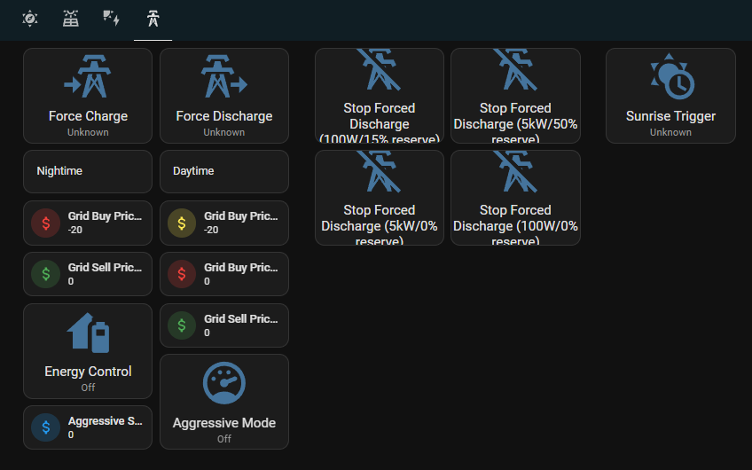

# Instructions continued...
> This is PART THREE of the instructions

## Step 7: Energy Management
This step is the major one. If you've got this far, congratulations. We're now going to create the main energy management Node-Red flows that will control your inverter after interrogating the current buy and sell prices from Localvolts, comparing with your own usage patterns, and estimating the amount of solar energy that is likely to be generated by your solar PV array for the rest of the day.
The decision logic that these flows take are based around what personally fit for me based on my PV array size, my battery size, and my electricity usage habits (and I am a big user of power, about 55kWh per day).
>The majority of these flows have come from the great repository [guysqr/node-red-ha-solar-management](https://github.com/guysqr/node-red-ha-solar-management), however I have modified it a bit and added some new flows to suit my personal needs more. Should you not like my modifications, feel free to use the original as a lot of work has gone into these flows.  On the shoulders of others we stand!

>[!TIP]
>You will probably want to sit down and work out your decision logic yourself and not rely on the code that is here, as it may not suit your setup and usage patterns.

>[!NOTE]
>You should keep these energy management flows disabled while you look through the code and decide on your own decision logic.

>[!WARNING]
>These flows do have the ability to **CONTROL** your inverter and import or export power when it is coded to do so, which may not be when you want. It may end up _**COSTING YOU MONEY**_ if it doesn't behave how you want it. YOU USE THIS SYSTEM AT YOUR RISK AND IT IS YOUR RESPONSIBILITY TO KNOW WHAT IT IS DOING. I TAKE **NO RESPONSIBILITY** FOR ANYTHING IT DOES - I REPEAT, YOU USE THIS AT YOUR OWN RISK!

### Preparation


### Node-Red flow deployment
1. Launch Node-Red from the side bar
2. From the hamburger menu at the top right, select "Manage palette"
3. From the "Install" tab of the palette, search for "traffic" and install "node-red-contrib-traffic"

4. Search for "sun-position" and install "node-red-contrib-sun-position"
   

5. Close the palette and then from the hamburger menu again, select import

6. Copy the contents from the [energy_control.yaml](flows/energy_control.json) file to your clipboard (view it as raw before you copy it)

7. Paste the contents of your clipboard to the import nodes text area


8. Select "new flow" (bottom left) and then "Import". If you are told that some of the nodes already exist in your workspace, click on "View nodes..." and then "Import selected". This will leave out the duplicated "Home Assistant" node that came with the Localvolts flow import.

9. A large number of nodes will be imported, all with blue dots above them. You should perform the following, and then once done, click on deploy:
    1. Confirm the inverter sizing is appropriate for you. Anywhere there is an export of 5kW, confirm that is correct for your situation.
    2. The "Slow battery charge?" node contains msg.battery_w that you should update appropriately. It is mostly set to import from the grid at 10kW.
    3. The "Full Battery Hour" node has a hard-coded battery capacity, you should update this.
    4. "PV Forecast East" and "PV Forecast West" will need your Solcast.com details added to them. Replace {site} and {key} appropriately.
    5. If you don't have EAST or WEST facing PV arrays, you can rename the node names but you'll need to update the code in the appropriate nodes as well.
    6. "PV Actuals East" and "PV Actuals West" will need to be updated, like the above East and West forecast nodes.
    7. Update the MQTT Broker node appropriately for your MQTT broker (installed previously). Click on the edit button inside the node and change the server to the IP address of your HASS server. Keep everything else as it is. Remember to click on Deploy to deploy the changes.

10. Using terminal, browse to the location _/addon_configs/a0d7b954_nodered/node-red/_ and create firstly a folder called _reference_ and then create and edit a file called **baseline-consumption.csv** (the following assumes Linux)
```
cd /addon_configs/a0d7b954_nodered/node-red/
mkdir reference
cd reference
nano baseline-consumption.csv
```
Paste your expected typical daily usage in WATTS (so, e.g., put 1000 for 1kW) against the hour. So there will be two values for each line, the first is the hour and the second is typical usage in watts, separated by a comma.

It will appear something like this (0 = midnight):


Once done, save and exit by CTL-X.

>[!TIP]
>There are probably a number of nodes or flows that you do not want. Once you understand what they do, feel free to delete them. Just make sure you know what they do before you delete them, or you may majorly break the flow and management system.

>[!WARNING]
>Make sure you have thoroughly investigated all the nodes in every flow and understand what they do before you let it loose on your inverter.  The main grey "Run every 15s" node is disabled by default for a reason. So are the other nodes that run at specific times, only enable them once you know what they do. Once you're ready and comfortable to let it do its thing, enable all the nodes and watch what it does until you are sure it is making the decisions that you want it to be making.  EDIT AND CHECK EACH NODE AND THE CODE IN THEM BEFORE ENABLING THESE FLOWS.  Open the debg window and watch for any flow errors and immediately follow them up to see what is going on.

### Add Home Assistant buttons and sliders
There are variuos buttons and sliders that the Node-Red flows depend on, to input things like buy and sell prices for spikes. This allows you define what you categorise as a spike, so you can buy or sell at a certain limit, if that's what you want.  They probably won't get changed much, but you the ability to do this very easily.  There is also an "energy control" button that will disengage the Node-Red energy management, if you would like control it manually.  There are also some charge and discharge buttons for near instant charging and discharging (that will only work when the energy management flows are not engaged, or else they will compete with you).

#### Create the helpers and inputs required for teh buttons and sliders
1. Go to Setting -> Devices & services -> Helpers
2. Create "+ Create Helper" and paste the following content into a helper:
```
Type: Button
Name: Force Charge Now
Icon: mdi:transmission-tower-import
```
4. Repeat the above step for each of the following:
```
Type: Button
Name: Force Discharge Now
Icon: mdi:transmission-tower-export
```

```
Type: Button
Name: Stop Forced Discharge (100W/0%)
Icon: mdi:transmission-tower-off
```

```
Type: Button
Name: Stop Forced Discharge (100W/15%)
Icon: mdi:transmission-tower-off
```

```
Type: Button
Name: Stop Forced Discharge (5kW/0%)
Icon: mdi:transmission-tower-off
```

```
Type: Button
Name: Stop Forced Discharge (5kW/50%)
Icon: mdi:transmission-tower-off
```

```
Type: Button
Name: Sunrise Trigger
Icon: mdi:button-pointer
```

```
Type: Number
Name: Grid Buy Price (Day-Spike-Prep)
Icon: mdi:currency-usd
Minimum value: 0
Maximum value: 200
Step size: 1
Unit of measurement: c
```

```
Type: Number
Name: Grid Buy Price (Day)
Icon: mdi:currency-usd
Minimum value: -20
Maximum value: 30
Step size: 1
Unit of measurement: c
```

```
Type: Number
Name: Buy Price (Night-Spike-Prep)
Icon: mdi:currency-usd
Minimum value: -20
Maximum value: 40
Step size: 1
Unit of measurement: c
```

```
Type: Number
Name: Grid Sell Price (Day)
Icon: mdi:currency-usd
Minimum value: 0
Maximum value: 500
Step size: 1
Unit of measurement: c
```

```
Type: Number
Name: Prep Grid Sell Price (Night)
Icon: mdi:currency-usd
Minimum value: 0
Maximum value: 100
Step size: 1
Unit of measurement: c
```
5. Once done, save the dashboard. You should see a dashboard like this with buttons on it - this is your manual control page.



6. You will notice that the coloured dollar icons are either set at 0 or -20. We will need to update these to something more realistic. The following is how I have them set up, but you might find different amounts suit you better (click on each and change the slider to the approriate number of cents):
    1. "Grid Buy Price (Night-Spike-Prep)": 25
    2. "Grid Sell Price (Night)": 50
    3. "Grid Buy Price (Day)": 4
    4. "Grid Buy Price (Day-Spike-Prep)": 49
    5. "Grid Sell Price (Day)": 199
  
7. Your buttons will appear similar to the following:


This dashboard will allow you to:
- Enable energy management
- Force charge or discharge from your battery manually
- Stop the charge or discharge and configure the settings (power/battery reserve) as appropriate
- Set the buy and sell prices

An explanation of the buy and sell price settings are as follows:
- Grid Buy Price (Night-Spike-Prep) - This is the price that you are willing pay up to should a morning shoulder price spike be detected from the upcoming 4hr forecast. The current settings (as above) sets the management to charge your battery to 40% at any price of 25c or under per kWh.
- Grid Sell Price (Night) - This is the price that defines a morning/shoulder "spike". This is NOT the price that the inverter will start discharging at, just what the predicted sell price is seen as being a "spike". The logic in the Node-Red flows will still discharge the battery as coded.
- Grid Buy Price (Day) - This is the highest price that you want to force charge your battery during the day, if the solar forecast indicates that you wont have enough charge come the demand period, starting 4pm.
- Grid Buy Price (Day-Spike-Prep) - This is the highest price that you are willing to pay up to should a evening spike be detected from the upcoming 4hr forecast, if your battery is not already full. The current settings (as above) sets the management system to charge your battery to 100% at any price of 49c or under per kWh.
- Grid Sell Price (Day) - This is the price that defines an evening demand period "spike". This is NOT the price that the inverter will start discharging at, just what the predicted sell price is seen as being a "spike". The logic in the Node-Red flows will still discharge the battery as coded.

### Battery Cycles sensor
If you browse to the PV dashboard, to the second tab, you will notice that an entity is not available - "sensor.battery_cycles_per_day".  We'll create this sensor now. It is a helper, just like the previous work you've just performed.

1. Go to Settings -> Devices & services -> Helpers
2. Click on "+ Create Helper"
3. Scroll down to "Template" and select it
4. The Template Helper page will appear, select "Template a sensor"
5. Enter the following:
```
Name: Battery Age Days
State template:  {{((as_timestamp(today_at()) - as_timestamp(last)) / 86400) | int }}
Unit of measurement: day
*Note: Replace YYYY-MM-DD with the date that your battery was installed*
```

6. Then create another template sensor helper, as follows (like previous sensor):
```
Name: Battery Cycles Per Day
State template: {{ ((states("sensor.total_battery_charge")|float) / (states("sensor.battery_age_days")|float) / 19.2) | round(4) }}
*Note, change 19.2 to your own battery capacity in kWh*
```

#### Import the dashboard with the controls on it
>[!TIP]
>Make sure you are ready for your energy management to start, as this will start the flows going if you proceed
1. Go into your PV Dashboard from the side bar.
2. Click on the edit/pencil icon at the top right
3. Click on the "+" on the header bar to create a new dashboard
4. On the "View configuration" page that pops up, select "Edit in YAML" from the 3 dot menu at the top right
5. Paste the content from the [grid-control.yaml](yaml/grid-control.yaml) file (remember to copy the raw content), and then "Save"

**We will create a Grafana dashboard in the next [instructions](instructions4.md) section.**
